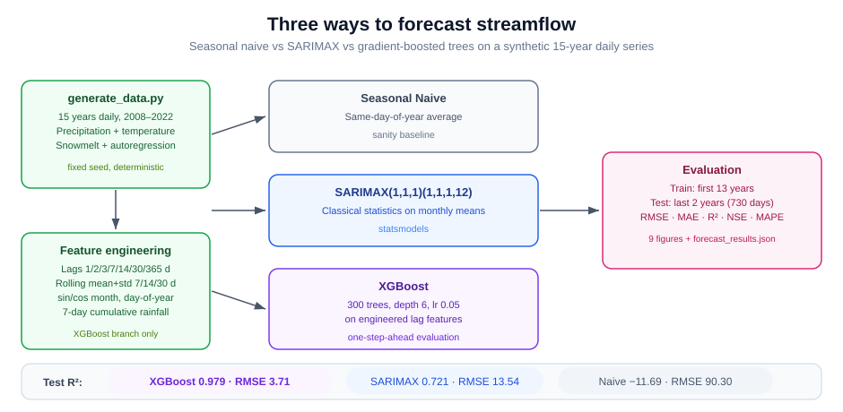
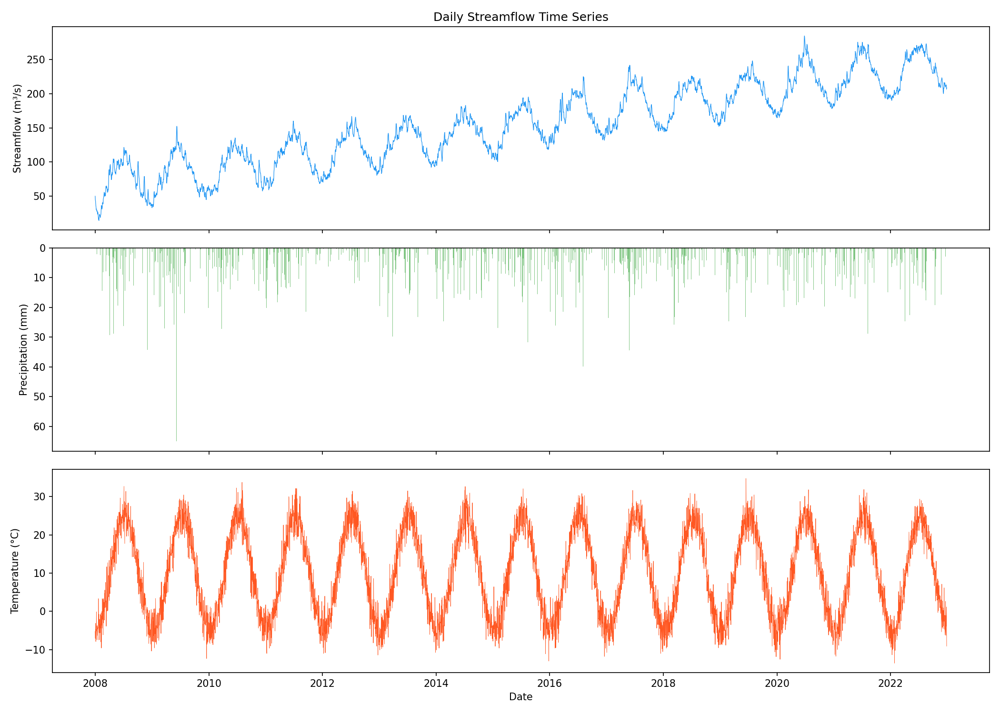
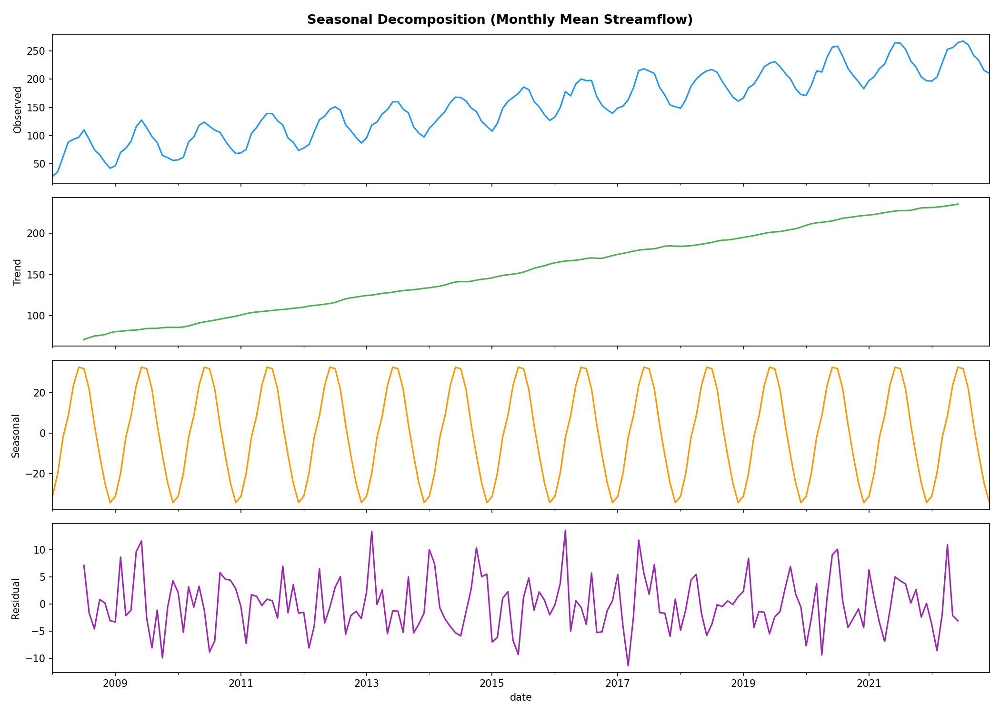
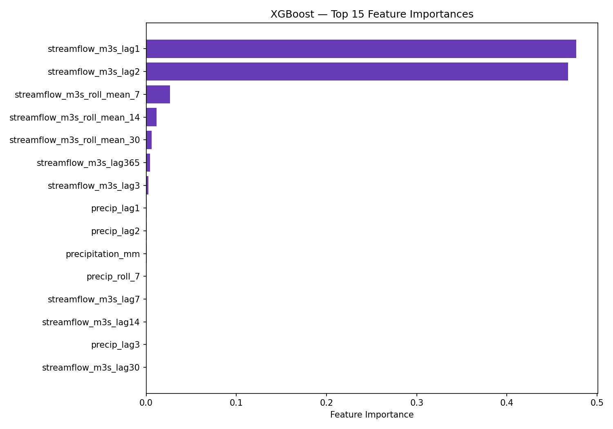
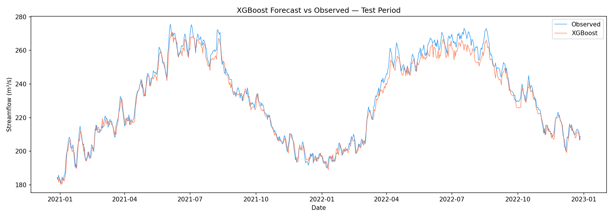
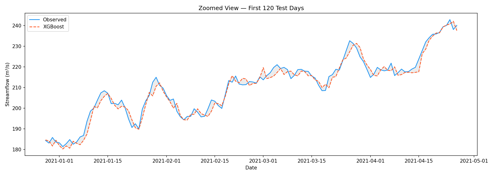
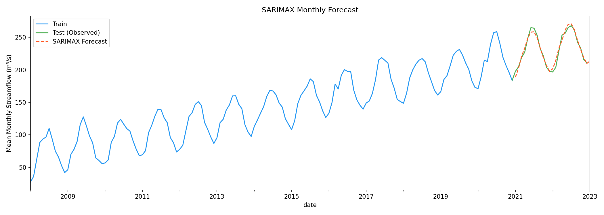
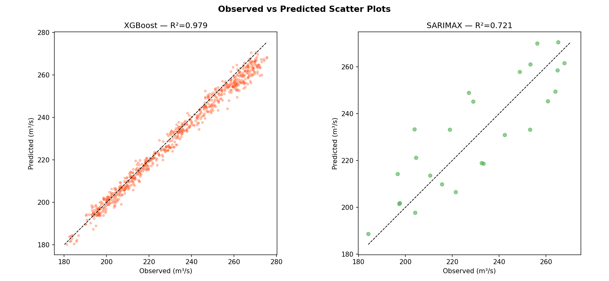
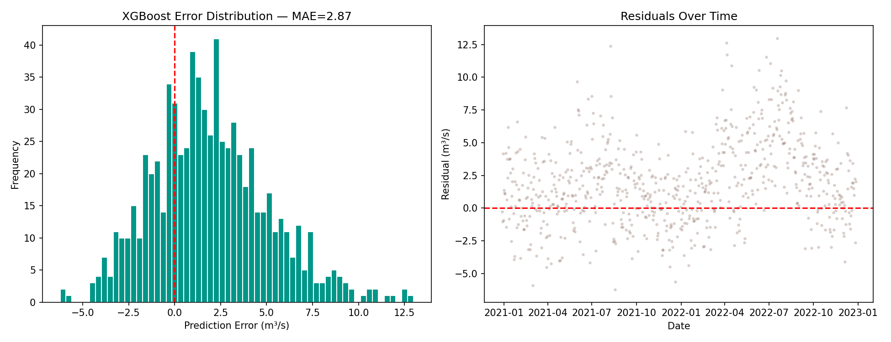
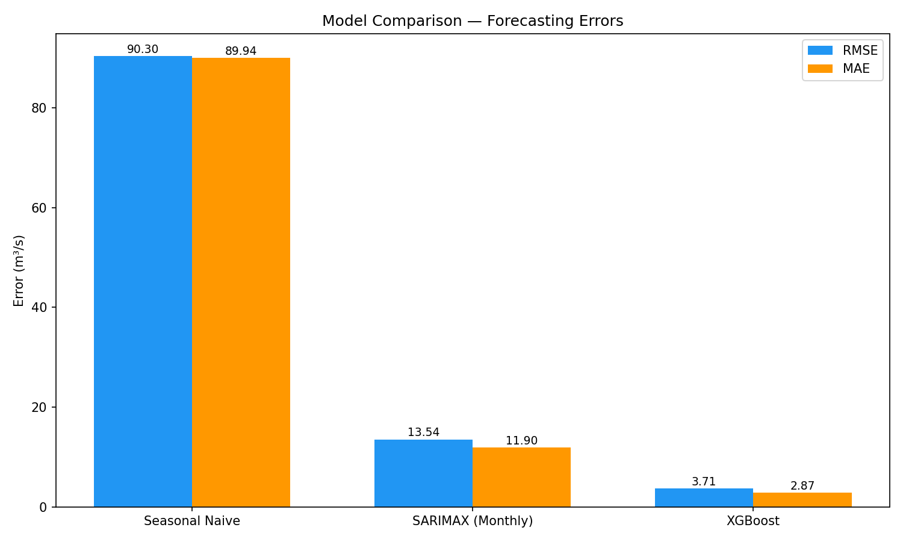

# Time Series Streamflow Forecasting

How much better is machine learning than classical statistics for streamflow forecasting — and how much better than just repeating last year? This experiment answers that honestly on a synthetic 15-year daily series: a seasonal-naive baseline, a SARIMAX fit on monthly means, and XGBoost on hand-engineered lag features, all scored with the metrics hydrologists actually use (NSE included).

The short answer: gradient boosting wins by a wide margin (R² 0.979 vs 0.721), and the naive baseline is not even competitive. The longer answer — feature importance, seasonal decomposition, and where each model fails — is in the figures below.



> **Scope:** This is a synthetic-data benchmark, not evidence of operational or real-catchment forecasting performance. The XGBoost evaluation is one-step-ahead: test features include discharge values observed at prior timestamps. It is not a recursive multi-day forecast evaluation.

## Results

| Model | RMSE (m³/s) | MAE (m³/s) | R² | NSE | MAPE (%) |
|-------|-------------|------------|-----|-----|----------|
| Seasonal Naive | 90.30 | 89.94 | -11.69 | -11.69 | 39.09 |
| SARIMAX (Monthly) | 13.54 | 11.90 | 0.721 | 0.721 | 5.22 |
| **XGBoost** | **3.71** | **2.87** | **0.979** | **0.979** | **1.20** |

### Time Series Overview



### Seasonal Decomposition



### XGBoost Feature Importance



### XGBoost Forecast vs Observed



### Zoomed View (First 120 Test Days)



### SARIMAX Monthly Forecast



### Scatter Plots



### Error Analysis



### Model Comparison



## Methodology

### Data
- 15-year synthetic daily streamflow time series (2008-2022)
- Features: precipitation (mm), temperature (°C)
- Seasonal snowmelt pattern, precipitation-driven events, autoregressive structure

### Feature Engineering (XGBoost)
- **Lag features**: 1, 2, 3, 7, 14, 30, 365-day lags
- **Rolling statistics**: 7, 14, 30-day rolling mean and standard deviation
- **Calendar features**: Cyclical month/day-of-year encoding (sin/cos)
- **Precipitation**: Lag and 7-day cumulative sum

### Models
1. **Seasonal Naive**: Same-day-of-year average from training set
2. **SARIMAX(1,1,1)(1,1,1,12)**: Applied to monthly means
3. **XGBoost**: 300 trees, depth 6, learning rate 0.05, with lag features

### Evaluation
- Train: first 13 years, Test: last 2 years (730 days)
- Metrics: RMSE, MAE, R², Nash-Sutcliffe Efficiency (NSE), MAPE
- XGBoost: one-step-ahead predictions using only lagged target and weather features

## Project Structure

```
.
├── src/
│   ├── generate_data.py   # Synthetic streamflow data generation
│   └── forecast.py        # Full forecasting pipeline
├── data/
│   └── streamflow.csv     (generated, not tracked)
├── results/
│   ├── figures/           # 9 visualization plots
│   ├── forecast_results.json
│   └── xgboost_model.pkl
├── docs/diagrams/         # SVG model-comparison diagram
├── requirements.txt
└── README.md
```

## How to Run

```bash
pip install -r requirements.txt
python src/generate_data.py
python src/forecast.py
```

The generator uses a fixed seed, so it recreates the synthetic input deterministically. The tracked figures and JSON record one reference run; versions of numerical libraries may cause small differences when rerun.

## Reproducibility Check

```bash
python scripts/check_repository.py
```

The check validates the tracked pipeline and reference artifacts without installing the ML stack or rerunning SARIMAX/XGBoost.

## Tech Stack

- **XGBoost** — Gradient boosted trees for daily forecasting
- **statsmodels** — SARIMAX time series modeling
- **scikit-learn** — Evaluation metrics
- **pandas / NumPy** — Data manipulation and feature engineering
- **matplotlib** — Visualization

## References

- Kratzert, F. et al. (2019). Towards learning universal, regional, and local hydrological behaviors via machine learning applied to large-sample datasets. *HESS*.
- Hyndman, R. J. & Athanasopoulos, G. (2021). *Forecasting: Principles and Practice*, 3rd edition.
- Nash, J.E. & Sutcliffe, J.V. (1970). River flow forecasting through conceptual models. *Journal of Hydrology*.

## License

MIT. See [LICENSE](LICENSE).
