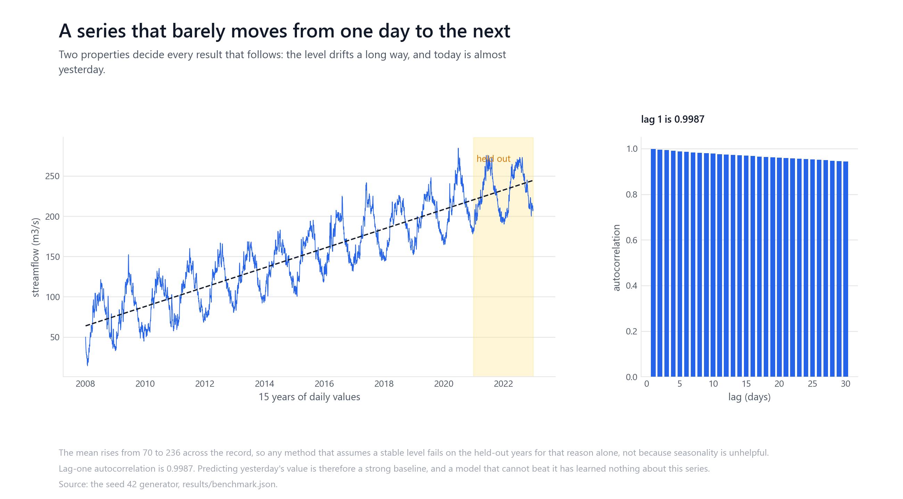
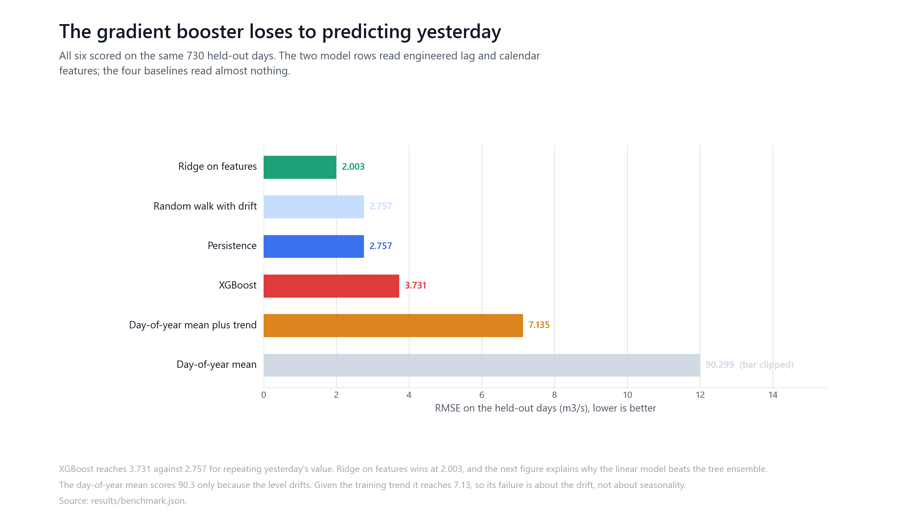
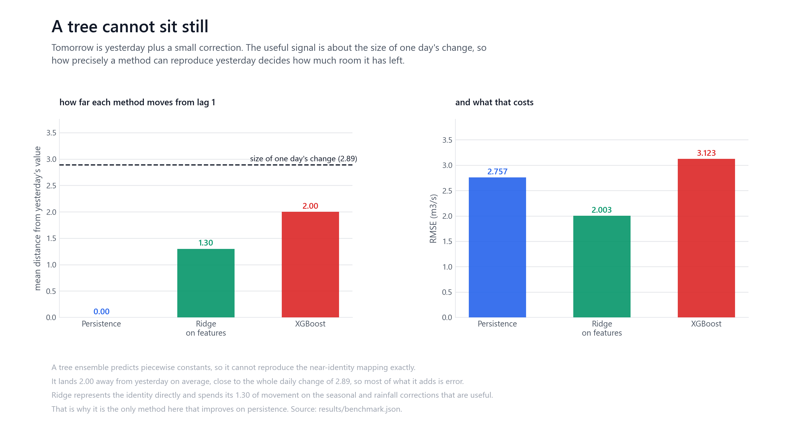
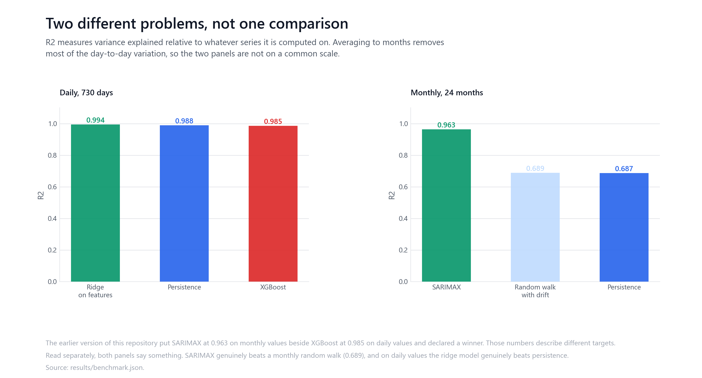

# When gradient boosting is the wrong tool

A controlled forecasting experiment on a synthetic daily streamflow series. It
compares SARIMAX, XGBoost and a ridge model against the baselines that actually
matter, and finds that the gradient booster loses to predicting yesterday's value.

**The series is not real.** It comes from a generator in this repository, seed 42.
There is no gauge, no catchment, no observed record. Nothing here is operational
hydrology and none of it says anything about forecasting a real river.

## What went wrong the first time

This repository previously reported XGBoost at R2 0.979 against SARIMAX at 0.721
and concluded that "gradient boosting wins by a wide margin". Two problems made
that unreadable.

**The two numbers described different targets.** SARIMAX was fitted and scored on
monthly averages, XGBoost on daily values. Averaging to months removes most of the
day-to-day variation, so the two R2 values are not on a common scale and cannot be
ranked against each other.

**The only baseline offered was one that could not win.** A day-of-year mean scores
R2 of -11.69 here, and that was reported as evidence the models were good. The
reason it fails has nothing to do with seasonality, as shown below.

Neither problem was leakage. The lag features are all shifted by at least one day
and the rolling statistics are taken after a shift, so no row sees its own target.
The split was already chronological. The conclusions were the problem, not the
plumbing.

## The series



Fifteen years of daily values. The generator carries 85% of yesterday's value into
today, adds a seasonal pull, a rainfall response over five lags, a small linear
trend and noise.

Two properties follow, and they decide every result:

**Lag-one autocorrelation is 0.9987.** Tomorrow is essentially today plus a small
correction, so repeating yesterday's value is a strong forecast. Any method that
cannot beat it has learned nothing about this series.

**The level drifts a long way.** The autoregressive loop divides the linear trend
by the 0.15 pull coefficient, amplifying it about sevenfold, so the mean rises from
70.5 in the first year to 236.2 in the last. That is why a day-of-year average fails:
it is fitted on years that sat far lower.

## Results



Daily, all six scored on the same 730 held-out days, the last two years:

| Method | RMSE (m3/s) | MAE (m3/s) | R2 |
| --- | --- | --- | --- |
| **Ridge on features** | **2.003** | **1.596** | **0.994** |
| Random walk with drift | 2.757 | 2.140 | 0.988 |
| Persistence | 2.757 | 2.139 | 0.988 |
| XGBoost | 3.123 | 2.430 | 0.985 |
| Day-of-year mean plus trend | 7.135 | 5.541 | 0.921 |
| Day-of-year mean | 90.299 | 89.935 | -11.692 |

XGBoost, reading twenty engineered lag, rolling and calendar features, is beaten by
a one-line baseline. A ridge model on those same features is the only method that
improves on persistence, and it does so by a real margin.

This is not a quirk of one generated series. Repeating the whole comparison on
five seeds, XGBoost fails to beat persistence on **all five**, and ridge wins on
all five. `results/benchmark.json` records each run.

One caveat on the XGBoost row specifically. Its exact score is not reproducible
across machines: the same seed and the same pinned version give 3.12 here and
3.42 on the CI runner, because the tree builder's floating point behaviour depends
on the platform. The ordering is unaffected, since every value seen is well above
persistence, but the number itself should be read as approximate. The repository
check compares published numbers within 10% for that reason, and compares the
finding exactly.

The day-of-year mean's -11.69 is entirely the drift. Given the training trend to
extrapolate, the same seasonal information reaches 0.921. Reporting the broken
version alone made the models look better than they are.

## What the feature models can see

The two models that read features get something the baselines do not. Every
engineered feature is shifted by at least a day, so no row sees its own target,
but the raw `precipitation_mm` and `temperature_c` columns pass through unshifted
and stay in the matrix. A row predicting day t therefore carries the rain measured
on day t, and the generator does drive same-day flow from same-day rain. That
makes this a nowcast with observed weather rather than a pure one-step-ahead
forecast, and persistence has no equivalent.

The conclusions do not depend on it, which is worth showing rather than asserting.
Refitting both models without those two columns, ridge without same-day weather
scores **2.429** and XGBoost without same-day weather scores **3.622**, against
persistence at 2.757. Ridge still wins and XGBoost still loses; the ridge margin
narrows from 0.75 to 0.33. `results/benchmark.json` records the ablation and the
repository check fails if either conclusion stops holding.

## Why the tree loses



The target is almost yesterday's value: the standard deviation of the daily change
is 2.89 against a series standard deviation of 55. So the entire job is predicting
a small correction on top of a number the model already has.

A tree ensemble predicts piecewise constants. It cannot represent the identity
function exactly, and on average it lands 2.05 away from yesterday's value, most of
the size of the whole daily change. Most of that movement is error rather
than signal.

Ridge represents the identity directly, with a coefficient near one on lag 1, and
spends only 1.30 of movement on the seasonal and rainfall corrections that are
genuinely useful.

This is not a claim that boosting is generally worse. It is a claim about this
shape of problem: when the target is dominated by a near-identity mapping from one
feature, a model that cannot represent that mapping cheaply starts at a
disadvantage that feature engineering does not fix.

## Daily against monthly



Both granularities are reported, separately, each with its own baselines.

| Monthly, 24 points | RMSE | MAE | R2 |
| --- | --- | --- | --- |
| **SARIMAX** | **4.679** | **3.829** | **0.963** |
| Random walk with drift | 13.562 | 11.589 | 0.689 |
| Persistence | 13.608 | 11.589 | 0.687 |

Read on its own terms, SARIMAX does well: it beats a monthly random walk clearly,
which is a genuine result the original framing obscured. What cannot be done is
compare its 0.963 with a daily 0.985 and call one better.

## Reproducing

```bash
pip install -r requirements.txt
python src/generate_data.py
python src/experiment.py
```

`src/experiment.py` regenerates the series from seed 42, refits every model and
baseline, and writes `results/benchmark.json`, which holds every number quoted
above. It takes well under a minute.

```bash
pip install -r requirements-dev.txt
python scripts/figures/generate_figures.py
python -m pytest -q
python scripts/check_repository.py
```

The check fails if this README stops stating the scores the recorded run produced,
and also if a future run reverses the central finding while the text still claims
it.

## Limitations

The series is synthetic and its structure is known, which is what makes the
comparison clean and also what makes it narrow. A real record would have gauge
error, non-stationarity from causes other than a linear trend, missing values and
regulation.

The result is about one series with one shape. A different autoregressive
coefficient, or a target that was not dominated by its own lag, could reverse the
ordering entirely. Nothing here says gradient boosting is generally unsuited to
time series.

The test period is a single contiguous two years per seed. The central finding is
repeated on five generated series, where XGBoost fails to beat persistence on all
five, but the margins themselves are point estimates rather than intervals.

The models forecast one step ahead with the true previous value available. That is
the easiest version of the problem, and multi-step forecasting, where errors
compound, would look very different.

## Provenance

The generator, baselines, experiment runner, tests and figures are the author's
own work. SARIMAX comes from statsmodels, the gradient booster from xgboost, and
ridge regression from scikit-learn.

A companion repository,
[Deep-Learning-Flood-Prediction-LSTM](https://github.com/mzquadri/Deep-Learning-Flood-Prediction-LSTM),
asks a different question on a different synthetic catchment: it forecasts
discharge from weather alone, without access to past discharge, so persistence is
not available to it at all. The two are separate experiments and share no data,
model or result.

## Licence

MIT. See [LICENSE](LICENSE).
